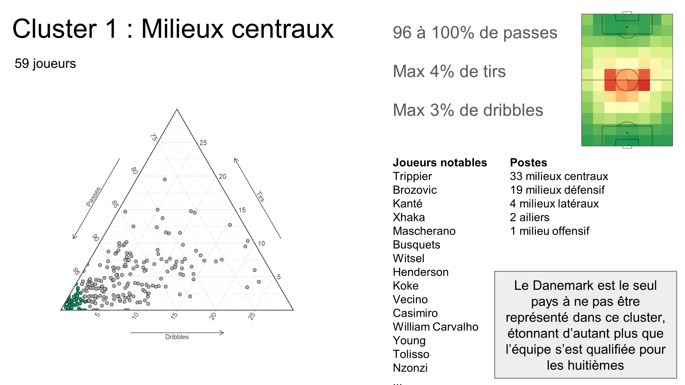

# PlayerStyle_WC
Analyse par cluster du style de jeu des joueurs lors de la coupe du monde.  
 
Inspiré par [FC_rStats](https://github.com/FCrSTATS) et son super travail.  
Et rendu possible par la générosité de [StatsBomb](https://github.com/statsbomb/open-data) qui permet l'accès à ses si riches données.  

La présentation est disponible ici : [Google slides](https://docs.google.com/presentation/d/e/2PACX-1vRe3J6J9wewgvoYd0at1jsUWRf2IguAeSVOccOewD-iGaQu6k8CzMa_OZmHUcRqjyrz9dvCWHayHaNq/pub?start=false&loop=false&delayms=60000). Vous pouvez également consulter les slides ci-dessous.
___

Cluster analysis of player style during the 2018 FIFA World Cup.  

Inspired by [FC_rStats](https://github.com/FCrSTATS) and his amazing work.  
And made possible thanks to [StatsBomb](https://github.com/statsbomb/open-data) generosity in sharing its data.  

The presentation is avalialable here: [Google slides](https://docs.google.com/presentation/d/e/2PACX-1vRe3J6J9wewgvoYd0at1jsUWRf2IguAeSVOccOewD-iGaQu6k8CzMa_OZmHUcRqjyrz9dvCWHayHaNq/pub?start=false&loop=false&delayms=60000). You can also see the slides below.

___

